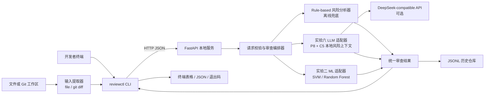

# 实验七计划书：命令行智能代码审查工具

## 0. 结论和执行边界

本实验采用 **命令行前端（CLI）+ 本地 Python HTTP 模型服务** 实现，而不开发 VSCode Extension。老师已经明确允许命令行实现，因此这是对指导书“VSCode 插件”呈现层的等价替换，不是删减功能。

原指导书要求的编辑器交互由以下 CLI 能力替代：从指定文件或 Git 工作区读取代码和修改内容、调用统一模型接口、在终端展示 Merge Prediction/审查意见/风险等级/定位信息，并保存历史记录。后端仍通过 HTTP 提供服务，保留前后端分离、模型可替换和工程部署三个核心目标。

**必须在报告的实验设计部分如实写明该替换及老师许可，不要把 CLI 描述为 VSCode 插件，也不要伪造插件安装、侧边栏或工具栏截图。** 报告中的“插件界面”统一表述为“命令行交互界面（经教师同意替代 VSCode 界面）”。

本实验的真实应用场景仍是：开发者在提交 PR 前，对当前 Git diff 或指定代码文件进行初步审查。模型输出仅是辅助意见，不能替代维护者决策。

---

## 1. 指导书要求到本方案的映射

| 指导书功能/任务 | CLI 等价实现 | 验收证据 |
| --- | --- | --- |
| 获取当前编辑文件 | `review --file <path>` 读取 UTF-8 源文件 | 终端输出中的 `source.kind=file` 与文件名 |
| 获取代码修改内容 | `review --repo <dir> [--staged]` 调用 Git 读取工作区或暂存区 diff | 输出中的文件数、增删行数、变更文件列表 |
| 调用代码审查模型 | CLI 以 HTTP `POST /v1/reviews` 请求本地 FastAPI 服务 | 服务日志、请求/响应 JSON、成功调用截图 |
| Merge Prediction | 显示 `merged/not_merged`、概率和置信度 | 两个固定测试样例的结果 |
| 自动生成代码审查意见 | 显示带风险级别、文件和行号的评论列表 | 至少一个含 `major/blocker` 的真实或构造 diff 样例 |
| 风险与代码位置可视化 | 终端表格显示 `severity/file/line/comment`，带 ANSI 颜色；无 TTY 时退化为纯文本 | 彩色终端截图和 `--no-color` 输出 |
| 历史审查记录 | 每次成功审查追加 JSONL；`history` 可筛选并查看详情 | 历史列表和单条详情截图 |
| 前后端通信 | FastAPI health/review/models 接口；CLI 只经 HTTP 调用 | `status`、OpenAPI 文档、接口测试 |
| 多模型集成 | 模型注册表：实验六 LLM 主模型、实验二 SVM/RF 条件适配、离线规则兜底 | `/v1/models` 返回状态；至少一种真实模型成功运行 |
| 功能测试 | 单元、API、CLI、文件规模和失败路径测试 | `pytest` 日志和性能结果 CSV |

### 1.1 最小可交付（必须完成）

1. FastAPI 服务能启动，`/health` 和 `/v1/models` 可访问。
2. CLI 能审查一个文件、一个 Git diff，并通过 HTTP 获得并打印结构化结果。
3. 不配置 API Key 时，离线 `rule-based` 模型仍能完成 Merge Prediction 和评论生成；因此演示不依赖外网。
4. 审查历史可保存、列出、查看；敏感代码正文默认不写入历史。
5. 至少一种真实的已有模型适配成功：优先实验六 DeepSeek LLM；无 API Key 时至少完成实验二模型的特征兼容性预检并在报告中写明可用/不可用状态。
6. 测试、截图、性能数据、LaTeX 报告均由实际运行生成，不填写臆造的耗时、概率或模型结果。

### 1.2 可选增强（基础完成后才做）

- `watch` 监听指定文件修改并提示再次审查，不自动调用模型。
- 使用 `--format json` 供其他工具消费结果。
- 输出 GitHub Actions annotation 格式。
- 以 VSCode Task 配置调用 CLI；这不是 Extension，不在报告中称插件。

---

## 2. 总体架构



### 2.1 关键设计决策

- **HTTP 固定为唯一前后端边界。** CLI 不导入服务内部模块，也不直接加载模型；这样未来补 VSCode 插件时只需替换客户端。
- **先稳定协议，再接模型。** 所有适配器返回同一结果 schema；模型失败时不会把不完整文本当成功结果。
- **离线可演示。** 规则模型是功能兜底，不冒充实验六模型。终端必须准确显示实际 `model_id`。
- **输入不泄漏标签。** 本地审查输入只来自文件内容、Git diff、路径和本地元数据；不读取 merge 状态、review decision、历史评论等审查后字段。
- **默认最小化保存。** 历史只存输入摘要、SHA-256、文件路径、统计量和审查结果；`--store-source` 才允许保存截断后的原文，且必须有明确警告。

---

## 3. 复用已有实验的方式

### 3.1 实验六：主 LLM 适配器

复用：

- `experiment6/src/llm_runner.py` 中的 API 调用、重试和 JSON 解析思路；不要从 CLI 直接调用它。
- `experiment6/src/improved_prompt_templates.py` 中 `P8 Strict Maintainer` 的风险审查原则和输出字段。

新适配器输入是本地文件/diff，而不是实验六的历史 PR 数据集。它只构造本地可见的上下文：文件列表、增删行、语言、测试文件存在性、配置/API 变更、diff/代码片段和规则风险清单。不得把实验五/六数据集中的真实 `is_merged`、历史结果或 review comments 拼入当前请求。

默认 LLM 配置从环境变量读取：`LLM_API_KEY`、`LLM_BASE_URL`、`LLM_MODEL`。未设置 key 时，`/v1/models` 应将 LLM 标记为 `unavailable`，原因明确为 `LLM_API_KEY not set`。

### 3.2 实验二：条件 ML 适配器

可加载的候选文件为：

```text
experiment2/results/models/svm_main.joblib
experiment2/results/models/randomforest_main.joblib
experiment2/results/models/scaler_main.joblib
```

实验二模型是以 PR 特征训练的，不能假装可以直接接收任意文本。实现者必须先完成 `ml_compatibility_check.py`：

1. 读取模型和 scaler 的 `n_features_in_`，读取训练特征表的列名与顺序。
2. 对当前 Git diff 可无泄漏计算的特征建立映射，例如文件数、增删行数、文件扩展名比例、测试文件比例、标题/描述长度（本地 CLI 没有 PR 标题时使用空值并记录）。
3. 输出 `results/compatibility/ml_feature_contract.json`，逐项标明 `supported`、`derived`、`unavailable`。
4. 只有全部必需特征可确定且维度/顺序与 scaler 一致时，才将该模型标记为 `ready` 并允许 `--model exp2-rf` 或 `--model exp2-svm`。
5. 若预检失败，模型必须保持 `incompatible`；报告展示该结论和原因，**不可伪造预测**。主流程仍由 `rule-based` 或 LLM 完成。

ML 模型只提供 Merge Prediction；Review Comment Generation 始终由规则分析器生成，并在结果中标识 `comment_generator=rule-based`。

**实施更新（部署兼容版）**：为确保实验二功能可以在 CLI 中实际运行，在不修改原始 61 维 PR 模型的前提下，基于实验二相同数据集和固定划分重新训练 45 维 `exp2-rf-deployable`、`exp2-svm-deployable`。该版本仅使用 Git diff 可计算的变更规模、文件类型、AST、CFG 和缺失标志，预处理器与特征顺序随模型管线保存。它仅支持 Git diff 输入；原始 `exp2-rf/svm` 仍明确标记为 PR 级不兼容，不能零填充后调用。

### 3.3 模型选择规则

`--model auto` 的顺序是：已就绪 LLM -> 已兼容 RF -> 已兼容 SVM -> `rule-based`。`--model <id>` 只使用指定模型；不可用时返回非零退出码并说明原因，绝不静默降级。演示时建议显式指定模型，截图才可复现。

---

## 4. 输入、输出与 HTTP 契约

所有 JSON 采用 UTF-8。Pydantic 模型是唯一协议来源；CLI、服务和测试不得各自复制一套 schema。

### 4.1 `POST /v1/reviews` 请求

```json
{
  "request_id": "uuid",
  "model_id": "rule-based",
  "source": {
    "kind": "git_diff",
    "repo_path": "C:/work/demo",
    "base_ref": "HEAD",
    "staged": false,
    "files": ["src/example.py"]
  },
  "content": {
    "diff": "diff --git ...",
    "files": [{"path": "src/example.py", "language": "python", "content": null}]
  },
  "options": {
    "max_chars": 24000,
    "store_source": false
  }
}
```

校验规则：`kind=file` 必须有单个文件正文；`kind=git_diff` 必须有非空 diff；正文/diff 在客户端截断前后都记录长度；路径不允许越出指定 `repo_path`。服务只绑定 `127.0.0.1`，不对局域网公开。

### 4.2 成功响应

```json
{
  "request_id": "uuid",
  "status": "success",
  "model": {"id": "rule-based", "kind": "rules", "version": "1"},
  "merge_prediction": "not_merged",
  "merge_probability": 0.31,
  "confidence": "medium",
  "risk_level": "high",
  "risk_factors": ["修改 public API 但未发现对应测试"],
  "review_comments": [
    {"file": "src/example.py", "line": 42, "severity": "major", "comment": "请为新的公开接口添加边界条件测试。", "rule_id": "missing-test"}
  ],
  "input_summary": {"changed_files": 2, "additions": 86, "deletions": 12, "content_sha256": "..."},
  "timing": {"extract_ms": 4, "model_ms": 18, "total_ms": 25},
  "history_id": "20260710T..."
}
```

数值仅为 schema 示例，不能进入最终报告。概率必须在 `[0, 1]`，评论严重度只允许 `nit/minor/major/blocker`，行号为正整数或 `null`。

### 4.3 其他端点和退出码

| 端点/命令 | 行为 |
| --- | --- |
| `GET /health` | 服务版本、启动时间、总体健康状态 |
| `GET /v1/models` | 每个模型的 `ready/unavailable/incompatible` 和理由 |
| `GET /v1/history?limit=20` | 历史摘要，默认不返回源代码 |
| `GET /v1/history/{history_id}` | 单条记录详情 |
| `reviewctl status` | 访问 health/models，打印可读状态 |
| `reviewctl review --file PATH` | 审查文件 |
| `reviewctl review --repo PATH [--staged]` | 审查 Git diff |
| `reviewctl history [--limit N] [--id ID]` | 列表或详情 |
| `reviewctl serve` | 启动 Uvicorn，仅监听 `127.0.0.1:8765` |

退出码统一为：`0` 成功；`2` 命令参数或输入错误；`3` 服务不可达；`4` 指定模型不可用；`5` 模型执行或响应解析失败。风险高不是程序错误，仍返回 `0`。

---

## 5. 计划目录和职责边界

在本文件所在目录下创建如下结构。若已有目录则保留用户文件，不要整体删除或覆盖。

```text
experiment7/
├── 计划书.md                         # 本文件
├── README.md                         # 可运行说明与真实状态
├── requirements.txt                  # fastapi, uvicorn, pydantic, rich, pytest...
├── src/
│   ├── __init__.py
│   ├── config.py                     # 路径、端口、大小上限、环境变量
│   ├── schemas.py                    # 唯一的 Pydantic 请求/响应 schema
│   ├── server.py                     # FastAPI 路由和异常映射
│   ├── cli.py                        # argparse/Typer CLI，纯 HTTP 客户端
│   ├── review_service.py             # 审查编排、统一结果、计时
│   ├── input_extractors.py           # file / git diff / 行号映射
│   ├── risk_analyzer.py              # 离线规则、定位和评论生成
│   ├── history_store.py              # JSONL 原子追加与读取
│   ├── model_registry.py             # 模型状态和 auto 选择
│   ├── adapters/
│   │   ├── base.py                   # 抽象接口
│   │   ├── rule_based.py             # 必需离线模型
│   │   ├── exp6_llm.py               # 可选 LLM 适配
│   │   └── exp2_ml.py                # 条件 ML 适配
│   └── ml_compatibility_check.py     # 特征契约预检
├── tests/
│   ├── fixtures/                     # 小型、非敏感 Git 样例仓库/源文件
│   ├── test_extractors.py
│   ├── test_risk_analyzer.py
│   ├── test_schemas.py
│   ├── test_history_store.py
│   ├── test_api.py
│   └── test_cli.py
├── results/
│   ├── history/reviews.jsonl
│   ├── compatibility/ml_feature_contract.json
│   ├── tests/pytest.txt
│   └── performance/file_size_benchmark.csv
├── figures/                          # 仅放由脚本或截图产生的 PNG
├── scripts/
│   ├── run_demo.ps1
│   ├── run_tests.ps1
│   └── benchmark.ps1
├── docs/
│   ├── main.tex
│   ├── experimentreport.cls
│   └── listing_style.tex
└── report/main.pdf
```

禁止从 `experiment2` 或 `experiment6` 直接写入或修改原有结果；实验七的日志、缓存、性能数据和图均放入 `experiment7/results`、`experiment7/figures`。

---

## 6. 分阶段实施清单（交接给其他 Agent）

下面任务按顺序执行。每个 Agent 接手前先读本文件、`README.md` 和其依赖阶段的验收结果；完成后更新 README 的“实际完成状态”，但不可提前勾选。

### 阶段 A：脚手架和可复现环境

**输入**：本计划书、`experiment6/README.md`、`experiment2/results/models/`。

**实现**：创建目录、`requirements.txt`、`config.py`、`.gitignore`（忽略 `.env`、`results/history/*.jsonl` 中的真实内容、Python 缓存），并写 README。`config.py` 用 `pathlib.Path` 定位项目根目录，不依赖当前工作目录。配置 `HOST=127.0.0.1`、`PORT=8765`、`MAX_CONTENT_CHARS=24000`、`MAX_FILE_COUNT=50`。

**验收**：在 `experiment7` 下运行 `python -m src.cli --help` 成功；README 中写明 Python 版本、安装命令、环境变量与不提交 API Key 的规则。

### 阶段 B：协议、输入提取和离线风险分析

**实现**：先写 `schemas.py` 和对应测试，再实现 `input_extractors.py` 与 `risk_analyzer.py`。支持：

- 单文件 UTF-8 读取；对无法解码、二进制文件、超大文件给出明确错误。
- Git 工作区 diff：默认 `git diff --no-ext-diff --unified=3`，`--staged` 使用 `--cached`；无变更时返回输入错误而不是“低风险”。
- 从 unified diff 中解析新文件路径和新增行号；评论行号无法可靠定位时设为 `null`。
- 离线规则至少包括：`missing-test`、`large-change`、`config-or-dependency-change`、`public-api-change`、`todo-or-placeholder`、`debug-print`。规则只根据内容和路径发出风险，不能断言真实是否会 merge。
- 规则模型以可解释的加权风险分数转换概率，并把转换公式写入代码注释和 README。

**验收**：针对 fixture 覆盖正常文件、Git diff、空 diff、二进制、无 Git 仓库、超限输入和行号定位；`pytest tests/test_extractors.py tests/test_risk_analyzer.py tests/test_schemas.py` 全绿。

### 阶段 C：服务、模型注册和历史

**实现**：`review_service.py` 只依赖抽象适配器；`server.py` 为 health/models/reviews/history 提供路由。历史写入以临时文件加替换或文件锁确保一次请求只追加一行有效 JSON；服务异常转换成稳定错误 JSON，不泄漏 API Key、完整环境变量或原始模型异常栈。

先接 `rule-based`，再接 `exp6_llm.py`；LLM 响应必须通过 Pydantic 校验。失败时写历史 `status=failed` 的无正文摘要，HTTP 返回合适的 4xx/5xx。

**验收**：FastAPI `TestClient` 覆盖成功、模型不可用、格式非法 LLM 响应、并发历史写入、history limit/详情；`pytest tests/test_api.py tests/test_history_store.py` 全绿。手工检查 `GET /docs` 与 `GET /health`。

### 阶段 D：实验二适配预检和条件集成

**实现**：分析 `experiment2/results/processed/features_main.csv`、scaler 和模型所需维度，生成特征契约 JSON。不得猜测缺失特征，不得用标签、PR 审查后字段或“默认 0”无声补齐特征。若全部特征可无泄漏计算，才实现预测并写集成测试；否则保持 `incompatible`。

**验收**：`python -m src.ml_compatibility_check` 生成带时间、模型路径、特征列表和决定理由的 JSON；`reviewctl status` 与 `/v1/models` 显示相同状态；报告使用该实际结论。

### 阶段 E：CLI 和端到端演示

**实现**：CLI 使用 `argparse` 或 `typer`，但不可把 FastAPI 函数当库调用。实现 `serve/status/review/history`，默认人类可读表格，`--format json` 输出完整机器可读 JSON，`--no-color` 保证重定向稳定。通过 `subprocess` 做 CLI 测试。

**演示顺序**：

```powershell
cd E:\latex\projects\experiments\experiment7
python -m src.cli serve
# 新开一个终端
python -m src.cli status
python -m src.cli review --file .\tests\fixtures\risky_example.py --model rule-based
python -m src.cli review --repo .\tests\fixtures\demo_repo --model rule-based
python -m src.cli history --limit 5
```

不要将 `tests/fixtures/demo_repo` 当真实 Git 项目，也不要在主仓库留下为演示而产生的未提交变更。

**验收**：CLI 通过 HTTP 调用服务；关闭服务时得到退出码 `3`；指定不可用 LLM 时得到退出码 `4`；规则模型的文件与 diff 两条路径均成功且留有历史。

### 阶段 F：测试、性能、图表、截图和报告

**实现与验收**：执行第 7、8、9 节。只在所有测试通过后编译报告；报告数据从 `results` 自动读取或人工复核后填入，禁止编造。

---

## 7. 测试与性能实验设计

### 7.1 功能测试矩阵

| 编号 | 场景 | 操作 | 预期 |
| --- | --- | --- | --- |
| T01 | 服务启动 | `serve` 后访问 health | HTTP 200，版本和模型状态存在 |
| T02 | 单文件审查 | `review --file` | 输出预测、风险、评论、耗时、history id |
| T03 | Git diff 审查 | 有修改的 fixture repo 执行 `review --repo` | 提取正确文件/增删行，评论有正确路径 |
| T04 | 暂存区审查 | 使用 `--staged` | 输入来自暂存 diff，不混入未暂存改动 |
| T05 | LLM 不可用 | 未配置 key 指定 `exp6-llm` | 非零退出，明确原因，无静默回退 |
| T06 | 空 diff | 干净 Git 工作区 | 参数/输入错误，不能输出“可合并” |
| T07 | 非 Git 目录 | `review --repo` | 明确错误，不崩溃 |
| T08 | 结构化输出 | `--format json --no-color` | 可由 `json.loads` 成功解析 |
| T09 | 历史 | 连续审查后 `history` 和详情 | 条数正确、源代码不默认出现 |
| T10 | 输入防护 | 二进制、超限文件、路径越界 | 拒绝并给稳定错误码 |

### 7.2 不同规模文件性能测试

用脚本在 `tests/fixtures/generated/` 创建固定内容、固定随机种子的 Python 文件，大小为 100、500、1000、3000 行；用 `rule-based` 连续运行 5 次，丢弃第一次的冷启动数据，记录其余 4 次的 `extract_ms/model_ms/total_ms`，计算中位数和 P95。输出：

```text
results/performance/file_size_benchmark.csv
figures/file_size_latency.png
```

报告只写实测结果。若 LLM 网络延迟参与测试，必须单独列出，不能同离线规则模型混为“工具性能”。

### 7.3 质量门槛

- 全量 `pytest -q` 通过；测试总数、通过数、运行时间写入 `results/tests/pytest.txt`。
- 代码格式化与静态检查若项目已配置则执行；没有配置不凭空声明通过。
- 覆盖率不是硬性门槛；若配置 pytest-cov，可报告实际覆盖率。
- 审查响应 schema 校验率应为 100%（测试和运行记录中成功响应均满足 schema）。

---

## 8. 取证清单（报告必须使用）

截图必须在真实运行时获取，裁剪前保留原始文件；图中不得出现 API Key、绝对用户目录、无关终端标签或敏感源代码。建议编号如下：

| 文件名 | 内容 | 对应指导书结果 |
| --- | --- | --- |
| `01_architecture.png` | 第 2 节架构图，由 Mermaid 导出 PNG | 整体架构图 |
| `02_model_status.png` | `reviewctl status` 和模型状态 | 模型接口/状态检测 |
| `03_file_review.png` | 单文件审查，显示预测、风险、评论、耗时 | Merge Prediction + 审查意见 |
| `04_diff_review.png` | Git diff 审查，显示变更统计和文件/行号定位 | 获取修改内容 + 结果展示 |
| `05_history.png` | history 列表和单条详情 | 历史记录 |
| `06_api_docs.png` | `http://127.0.0.1:8765/docs` 的接口定义 | 模型调用流程 |
| `07_tests.png` | pytest 全绿摘要 | 功能验证 |
| `08_performance.png` | 文件规模延迟曲线 | 性能分析 |

若无法截取浏览器，`06_api_docs.png` 可由 `/openapi.json` 的格式化终端输出替代，报告中说明是 CLI/HTTP 方案。

---

## 9. 实验报告写作计划

### 9.1 报告文件

复制 `experiment6/docs/experimentreport.cls` 与 `listing_style.tex` 到 `experiment7/docs/`，以其版式新写 `main.tex`。标题为“实验七：命令行智能代码审查工具”。保留封面中的真实姓名、学号、日期字段，填入前先由负责人确认。

### 9.2 建议章节及必填证据

1. **实验目的**：开发流程中早期代码审查、实现统一模型服务和 CLI 交互的目标。
2. **方案与架构**：说明教师允许 CLI；给出架构图、模块职责、HTTP 协议和安全边界。
3. **实现过程**：输入提取、模型注册/适配、风险定位、历史记录、终端呈现。只贴关键短代码，不贴整文件。
4. **模型集成说明**：分别说明实验六 LLM 的可用状态、实验二 ML 特征预检结论。实际不可兼容也应如实报告，不能将规则引擎说成已有 ML 模型。
5. **测试与结果**：功能测试矩阵的实际结果、8 张截图、文件规模基准表/曲线、实际异常处理表现。
6. **分析与局限**：规则模型的局限、LLM 网络时延和输出不稳定性、ML 特征分布差异、CLI 相对 IDE 的交互不足。
7. **实验思考**：逐题回答指导书 7.9 的 5 个问题，见 9.3 的答题提纲。
8. **结论**：是否完成“命令行等价方案”的每项验收，明确尚未实现的增强功能。

不要在报告中声称“实时”“高准确率”“部署成功”却没有对应测量或截图。规则模型的概率是启发式风险分数，不应与实验五/六的分类指标做横向性能比较。

### 9.3 指导书思考题答题提纲

| 问题 | 结合本实验应回答的要点 |
| --- | --- |
| 为什么审查工具应集成 IDE？ | 可缩短反馈周期、利用当前文件和未提交 diff；本实验 CLI 验证了服务边界，IDE 只需成为新的客户端。 |
| 前后端分离优点？ | 模型独立升级、客户端轻量、可统一协议和权限；代价是服务启动、网络超时和版本兼容。 |
| 如何提高速度与体验？ | diff 截断、内容哈希缓存、异步/后台调用、清晰进度、离线规则快速反馈、LLM 超时和可解释错误。不可声称已实现未做的缓存。 |
| 遇到哪些工程问题？ | Git 状态差异、二进制/超大文件、行号映射、LLM JSON 不稳定、旧 ML 特征不匹配、历史隐私；逐项写实际解决措施。 |
| 后续功能？ | VSCode Extension、PR 平台集成、增量审查、模型版本评测、自动修复建议、团队策略与权限控制。 |

### 9.4 编译和视觉检查

```powershell
cd E:\latex\projects\experiments\experiment7\docs
xelatex -interaction=nonstopmode main.tex
xelatex -interaction=nonstopmode main.tex
```

将 PDF 放在 `experiment7/report/main.pdf`。编译后逐页检查：中文无乱码、表格不溢出、图片清晰、引用编号正确、没有 `??`、没有编造的占位符和敏感信息。若本机缺少 XeLaTeX，保留 `.tex` 与明确的未编译原因，不要创建假 PDF。

---

## 10. Agent 交接规则和完成定义

建议按“阶段 A-B / C-D / E-F”顺序交接，避免多个 Agent 同时改 `schemas.py`、`config.py`、`README.md` 或 `docs/main.tex`。接手者必须先检查工作区变更，不回滚别人的改动。

每次交接消息应包含：已完成文件、执行命令、测试结果、未完成项、阻塞条件、真实模型状态和新增结果文件。不要只说“完成了”。

最终完成必须同时满足：

- [ ] `README.md` 的安装、启动、审查和历史命令已在当前环境验证。
- [ ] `pytest -q` 全部通过，结果存档。
- [ ] 文件与 Git diff 审查均经 HTTP 端到端运行成功。
- [ ] `/health`、`/v1/models`、`/v1/reviews`、`/v1/history` 均有测试。
- [ ] 实验二模型的兼容性结论有 JSON 证据；实验六 LLM 状态明确且无伪造调用。
- [ ] 至少 6 张关键取证图和性能数据存在，且来自真实运行。
- [ ] `docs/main.tex` 与 `report/main.pdf`（或明确的编译阻塞说明）完整对应实际结果。
- [ ] 报告明确说明 CLI 是经教师同意对 VSCode 插件的替代。

---

## 11. 风险与回退方案

| 风险 | 回退方案 | 报告口径 |
| --- | --- | --- |
| 无 DeepSeek API Key 或网络不可达 | 使用 `rule-based` 完成全部 CLI/HTTP 演示，LLM 标记 unavailable | “接口已实现，当前环境未配置密钥，未进行 LLM 实测” |
| 实验二模型特征不兼容 | 生成契约 JSON、保持 incompatible，不强行补特征 | “模型面向 PR 数据训练，任意本地 diff 无法保证无泄漏特征等价” |
| 无 Git 或 fixture 无修改 | 单文件路径仍可演示，Git 测试标记环境阻塞并给出错误截图 | 不把未运行的 Git 测试写为通过 |
| LaTeX 不可用 | 交付已验证的 `.tex`、图片、数据和编译日志 | 明确“环境缺少 XeLaTeX”，不交假 PDF |
| 终端不支持 ANSI | 用 `--no-color` 输出，保留结构化字段和严重度文本 | 展示无色终端截图 |

本计划优先保障功能可运行、接口可扩展、实验过程可复现和报告证据真实；VSCode 插件可以作为后续在同一 HTTP 协议上的新增客户端，而不需要推翻本实验实现。
